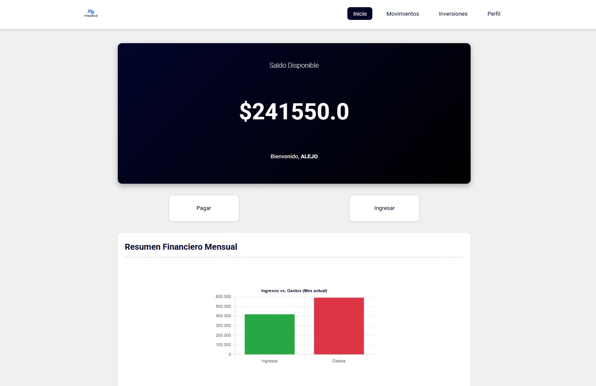
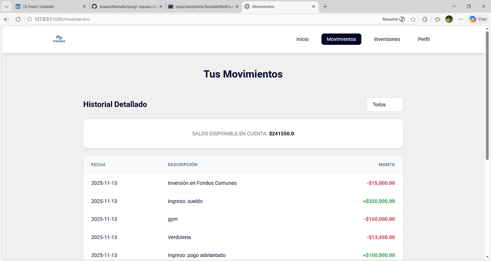
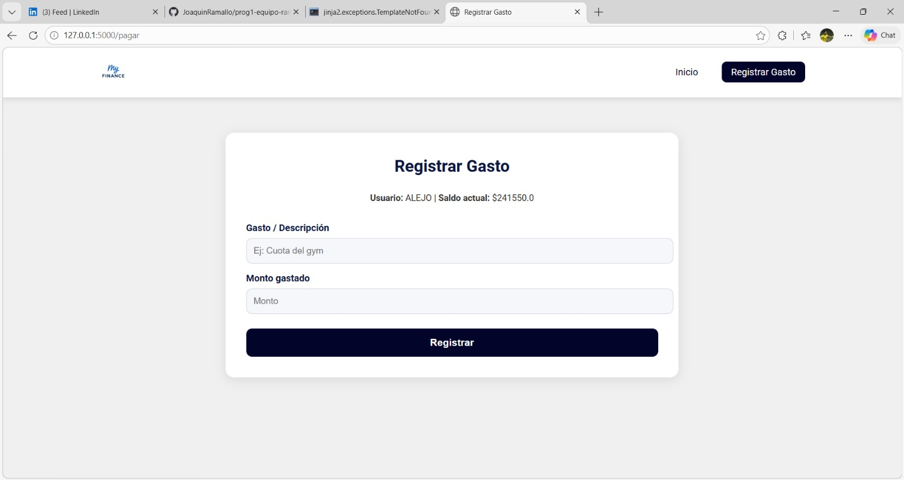

# MyFinance 💰

Aplicación web para gestionar finanzas personales o empresariales. Permite registrar ingresos, gastos y visualizar transacciones para llevar un control del dinero.

## Funcionalidades

- Registro de ingresos
- Registro de gastos
- Visualización de transacciones
- Control del balance financiero

## Tecnologías utilizadas

- Python
- Flask
- HTML
- CSS
- JavaScript
- JSON

## Objetivo del proyecto

Este proyecto fue desarrollado como práctica académica en la carrera de Desarrollo de Software para aplicar conocimientos de programación web y desarrollo de aplicaciones.

## Autor

Joaquin Ramallo  
Estudiante de Desarrollo de Software - UADE

## 🖼️ Capturas de la aplicación

## ▶️ Cómo ejecutar el proyecto

1. Clonar el repositorio:
   git clone https://github.com/JoaquinRamallo/prog1-equipo-ramallo.git

2. Entrar al proyecto:
   cd prog1-equipo-ramallo

3. Instalar dependencias:
   pip install -r requirements.txt

4. Ejecutar la aplicación:
   python app.py
